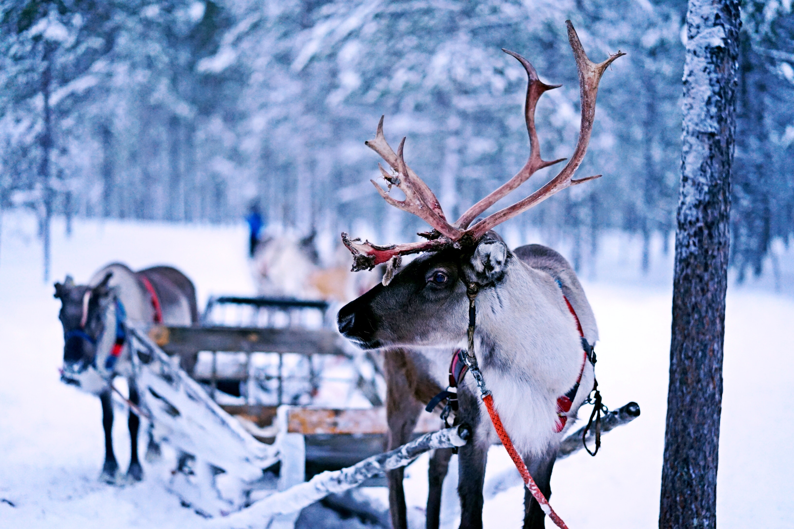

# Challenge 6: 🦌 The reindeer on trial



The elves are cataloging Santa's reindeer 🦌 based on the distance they can travel.

For this, they have a text string movements where each character represents the direction of the reindeer's movement:

* > = Moves to the right
* < = Moves to the left
* \* = Can move forward or backward
For example, if the movement is >>*<, it goes to the right twice, then it can go either left or right (whichever maximizes the final traveled distance) and then left.

The elves want to know what the maximum distance the reindeer travels is after completing all movements.

In the previous example, the maximum distance the reindeer travels is 2. It goes to the right twice +2, then with the * it can go to the right again to maximize the distance +1 and then it goes to the left -1.

Create a maxDistance function that takes the text string movements and returns the maximum distance that the reindeer can travel in any direction:

```JavaScript
const movements = '>>*<'
const result = maxDistance(movements)
console.log(result) // -> 2

const movements2 = '<<<>'
const result2 = maxDistance(movements2)
console.log(result2) // -> 2

const movements3 = '>***>'
const result3 = maxDistance(movements3)
console.log(result3) // -> 5
```

Photo by <a href="https://unsplash.com/es/@arainbowman?utm_content=creditCopyText&utm_medium=referral&utm_source=unsplash">Norman Tsui</a> from <a href="https://unsplash.com/es/fotos/trineo-tirando-de-renos-KBKHXjhVQVM?utm_content=creditCopyText&utm_medium=referral&utm_source=unsplash">Unsplash</a>